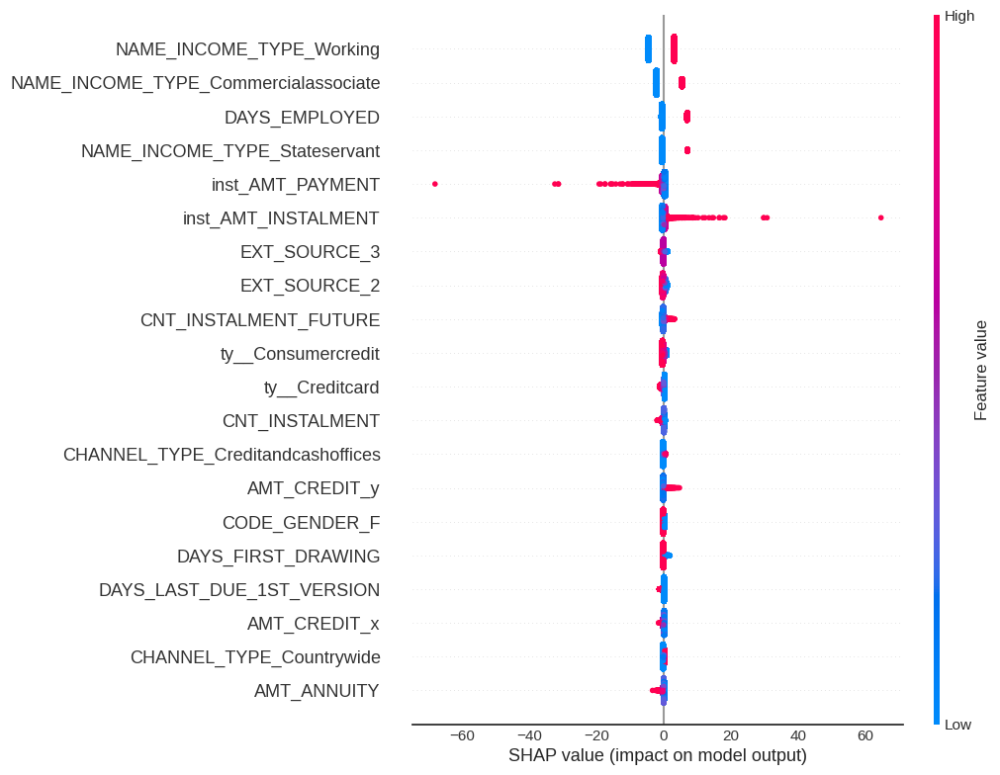

# Scoring model

## Project overview
&nbsp;

* This project is about building a **classifier** that predicts whether a **borrower will default on his loan**

* The underlying objective is to **minimize** as much as possible the **risk** to grant credit to a borrower that is **likely to default**

* Since the target is **binary** it consists of a **supervised binary classification** task  
&nbsp;

### Workflow

* **aggregated** the tables of the database

* **explored** the data and implemented **feature engineering** with both feature **selection** and **creation**

* defined a **custom metric** that penalizes more **false negatives**

* compared and optimized **estimators** using CV 

* implemented data **augmentation** techniques

* defined **optimal threshold** for predictions using CV

* predicted test samples target values with **best model** & concluded on both model **generalization** and **interpretation**

* coded an interactive **dashboard** with **Streamlit**

* coded an API with **Flask** to serve the model
&nbsp;

&nbsp;

## Project installation

* use command pip install -r requirements.txt to install the **dependencies**

* the data is directly available in the repository in zip format or can be downloaded  [here](https://s3-eu-west-1.amazonaws.com/static.oc-static.com/prod/courses/files/Parcours_data_scientist/Projet+-+Impl%C3%A9menter+un+mod%C3%A8le+de+scoring/Projet+Mise+en+prod+-+home-credit-default-risk.zip). The csv files should be stored in a folder named Data to reproduce code in the notebook

* it is **necessary that the notebook is run before the dashboard and the API script** 

* running the notebook will export in a folder named **Objects** the objects loaded in the two scripts

* the API should be served first by initializing a server with following commands:
    * export FLASK_APP=Flask_API.py
    * flask run

* the local port where is served the API may then need to be modified in the Dashboard script before running it with **streamlit run** Dashboard.py
&nbsp;

## **Detailed workflow**
&nbsp;

## **Aggregated tables**

1. Converted of categorical features of each table to **dummies**

2. Aggregated by **mean** on key for each table

3. Engineered a 'count' column according to the number of occurrences of each key label for each table

4. Aggregate data set : 
    i. 307,511 lines
    ii. 504 columns
&nbsp;

## **Shape, duplicates, missing values** 

&nbsp;

## **Target**

&nbsp;

* The distribution of the target is **strongly unbalanced**

* We will consider **oversampling** in the workflow to train the estimators on a balanced dataset

* Risk of training on unbalanced targets is to produce **bias** and **poorly predict the minority class**

* Aside the common test set, we will separate a validation dataset that will evaluate estimators trained on augmented data
&nbsp;

**Data splits**

**Subset of data**

Since the data is **large enough and to speed up the calculations**, we will keep **10%** of the rows of the remaining data for the train set.
&nbsp;

## **Feature selection**

* Given the high dimensionality of the data (504 features), we will implement the feature selector class built by Will Koehrsen and hosted on GitHub. This will the reduce its dimension based on principles : 
    * percentage of Nans superior to a specified threshold (we'll take 60%)
    * **zero variance**
    * absolute Pearson correlation superior to 0.98 (**redundancy**)
    * zero or minimal **feature importance** in trained LGBM Classifier (the feature does not contribute to 99% of the cumulative feature importances)
&nbsp;

    

### **Univariate**

#### **NANs**

Nans ratio > 60% (57 features)

&nbsp;

### **Zero variance**

Features with **zero variance** (20 features)

&nbsp;

### **Pearson correlation**

Features with absolute Pearson correlation > 0.98 (40 features)

&nbsp;

### **Feature importance**

Features not contributing to 99% of cumulative feature importance of an LGBM model trained on cleaned data after implementing the above feature selection criteria

&nbsp;

&nbsp;

Training the LGBM model gives us some insights about the data:
* the **EXT SOURCE** features, which correspond to credit scores are the most important for LGBM

* Quantitative features giving information on credit and installement amounts are also useful 

* Age may also help the estimator to predict better the defaults

## **Exploration**

### **Feature engineering**

* Among the most important features according to LGBM is the amount of credit which seems logical

* We also have features that give information about the **income** of the **borrower**

* Creating features connecting these informations may be useful for any estimator

* We will create three features:
    * annuity/income
    * annuity/credit
    * income/credit
&nbsp;

&nbsp;

* There is some linear correlation between some pairs of the created features

* The coefficients are not that close to 1 though so we assume here that each of these features brings a reasonable portion of non redundant information
&nbsp;

&nbsp;

* The engineered annuity/credit ratio feature is among the most important when training the LGBM model

* It confirms our intuition that linking the existing features could help the model to fit better
&nbsp;

### **Missing values**

* We will perform a last check for missing values in the table to decide to imputing strategy

&nbsp;

* Percentage of Nan values among the most important features is 11% which is satisfying

* The matrix above shows there are no deficient samples with missing values on majority of most important features

* Naive imputation will be a good choice since it keeps central tendency of the distributions, and given the relatively low proportion of Nans, the distributions distorsion will be reasonable
&nbsp;

### **Most important features distributions**

* We will now control the distributions of some of the most important features according to LGBM

* These features may also be determining for other estimators 

* Some estimators such as Logistic Regression are really sensitive to outliers. Therefore we would want to work with distributions as close as possible to Gaussian distributions
&nbsp;

&nbsp;

* The majority of distributions do not look Gaussian-like, nor are there unreasonably skewed with strong outliers

* A subset of these features, in particular EXT SOURCE features,  do look Gaussian-like which is positive

* We won't perform any transformation on features here (such as log to normalize)

### **Features vs target**

&nbsp;

* Clients that default tend to have lower credit scores (EXT source features) than those wo don't

* These plots suggest a degree of dependency between some of the features and the target, which may make them relevant to predict accurately the probability of default of clients
&nbsp;

## **Modelling**

* We will compare in this step the estimators's performance on commonly used metrics for binary classification using Cross-validation method

* Aside the usual metrics, we will create a **custom metric** that penalizes more a model that would predict **false negatives** (no default vs actual default) in order to minimize the lending society's risk

* This will be the decisive metric to **optimize** the model
&nbsp;

### **Custom metric**

* The custom metric takes inspiration on **F1-score** : harmonic mean of precision & recall

* Since the objective is to minimize the risk of lending to a client that would default, we will consider as metric a weighted harmonic mean giving **more weight for recall**

* Recall weight  = **5** * precision weight
&nbsp;

### **Pipelines**

* **Preprocessing**
    * **median imputation** : 
        * given the **satisfactory fill rate**
of the table, we opt for a **simple** imputation by the **median** on each feature. 
        * This choice maintains the central trend of the different features in case there are **outliers**. 
        * In addition, the
the imputation by this naive method will allow not to distort too much the distribution given the low level of missing values.
    * **scaling** : 
        * standardization is a necessary step prior to training some estimators, particularly those based on the concept of distance.
        * In the case of **logistic regression**, it allows to interpret **coefficients** as feature **weights**. 
        * Even though it is not compulsory for all estimators, the transformation will be carried out for the whole predictors so that they are trained on the same data set.

* **Estimators**
    * linear estimators: 
        * logistic regression, support vector machines
    
    * non linear estimators :
        * random forest, light gradient boosting
    
    * dummy :
        * dummy classifier for the baseline

&nbsp;

* Given the current settings, **logistic regression** seems to be the most performing estimator accross metrics, with a better overall performance measured by **ROC AUC**

* This suggests an **underlying linear relationship** between the features and the target
&nbsp;

#### **Train/validation scores**

&nbsp;

* Linear models **overfit** much less than non linear models

* Ensemble algorithms such as RandomForest or LGBM overfit much more, which suggest their **hyper-parameters are not optimal** and should be improved
&nbsp;

### **Data augmentation**

* We will now train the estimators on augmented data implementing several techniques:
    * SMOTE over sampling
    * Random Over and Under Sampling
    * train estimators on data resampled with various proportions

* We will reset the settings of the estimators so they do not take into account the unbalanced class weights

&nbsp;

* Globally, the performance of the estimators tend to improve as the proportion of minority samples increases, which is logic. Training on more positive samples will have the model predict more positive samples and improve recall

* The performance is also quite variable accross methods

* As when comparing estimators on CV scores, logistic regression seems to be the most performing estimator on this metric. Its performance is very consistent accross methods

* The hierarchy is quite similar. LGBM performs also well. Though its overall performance seems weeker than other estimators, SVM may be a good estimator to predict defaults

* We will optimize these three estimators to select the best
&nbsp;

### **Logistic regression, LGBM & SVM optimization**

* Optimization method : **CV**

* Score : **custom metric**

* Including a **SelectFromModel** class in the Pipelines to perform feature selection 
    * Logistic regression & SVM : feature selection based on **coefficients** threshold optimized with GridSearchCV
    * LGBM : feature selection based on **feature importances** threshold
    optimized with GridSearchCV

* Feature selection :
    * **significantly** improves LGBM performance
    * slightly improves Logistic regression performance
    * does not improve SVM performance

* Hyperparameters optimization:
    * Logistic regression & SVM : joint optimization
    * LGBM : sequential optimization (using both GridSearch and RandomizedSearchCV)

&nbsp;

* The optimized version of Logistic Regression is the most performing on the custom metric

* Its overall performance is also the best among tested estimators (ROC AUC)

* Optimization of LGBM improved significantly its score on the custom metric but not its overall performance  

* Our best estimator is the optimized version of logistic regression
&nbsp;

&nbsp;

* Interesting to see how optimization significantly **reduced LGBM's overfitting**
&nbsp;

### **Optimal threshold**

* The default threshold for predictions is 0.5

* We will try to define an optimal threshold ie which maximises score on custom metric

* Method : CV

* The optimal threshold will be the **average** of optimal thresholds of each cv-fold

&nbsp;

Optimal threshold ~ **0.46**
&nbsp;

### **Predictions on test set**
&nbsp;

&nbsp;

* The model performance **generalizes well**

* The score on the test set is **slightly higher** than the mean score on validation cv-folds
&nbsp;

#### **Score interpretation**

&nbsp;

* The optimization on custom metric favoured a model with **high recall** ie **low number of false negatives**, which was expected
&nbsp;

#### **Confusion matrix**

&nbsp;

The cost of having high recall is to predict en elevated proportion of **false positives**.
&nbsp;

### **Model interpretability**

**Coefficients**

&nbsp;

* Blue bars represent positive coefficient values, red negative

* For example high values on EXT SOURCE features tend to reduce probability of default

* Interesting to note that the **contribution of features when fitting a model vary accross estimators**, **EXT SOURCE** features appeared to be more relevant when fitting an LGBM than when fitting a Logistic regression

* We should add that correlation between features is likely to affect the coefficient values and reduce their interpretability

**Shapley values**

* **Shapley** values are a method resulting from **game theory**, which seek to measure, for a given observation, the **contribution of
each feature to the output value of the model**. They are mainly
useful for explaining model predictions not immediately
interpretable. It is said that these methods of interpretation, among which are
Shapley values and also LIME values are included, are agnostic to the
models.
&nbsp;

&nbsp;

* We control that the most determining features according to Shapley values match the features with higher absolute coefficients, which is the case here

* The direction of contributions according to Shapley are also consistent with the feature coefficients

* For example high values on NAME_INCOME_TYPE_Working tend to increase the probability of default of clients according to Shapley, which is consistent with the positive coefficient of the feature

**Prediction explanation with Shapley : example**

&nbsp;

# Conclusion

* We trained a **classifier** that predicts the probability that a potential borrower goes to **default**

* The chosen classifier is an implementation of **Logistic Regression**

* It was optimized to minimize the risk of granting credit to client that would default ie minimizing **false negatives**.

* Prior to estimators' selection & optimization we preprocessed the data implementing **feature selection** principles and **creating** features

* Further research shall :
    * try other estimators
    * implement **feature engineering by creating new features**
    * implement a **step forward** feature selection process to **simplify** the model
    * implement **dimension reduction** techniques such as **PCA** to reduce **redundancy** among features
&nbsp;

#### The notebook is accessible [here](Notebook.ipynb). The notebook may be run immediately after **unzipping** the Data file.  

